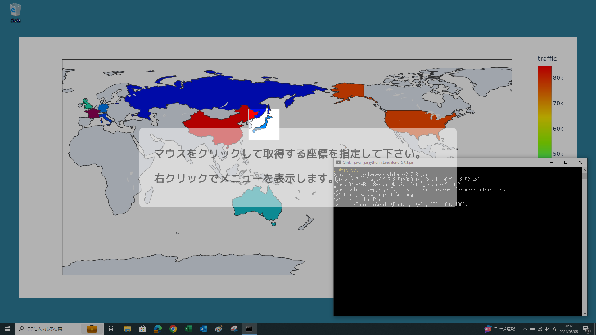
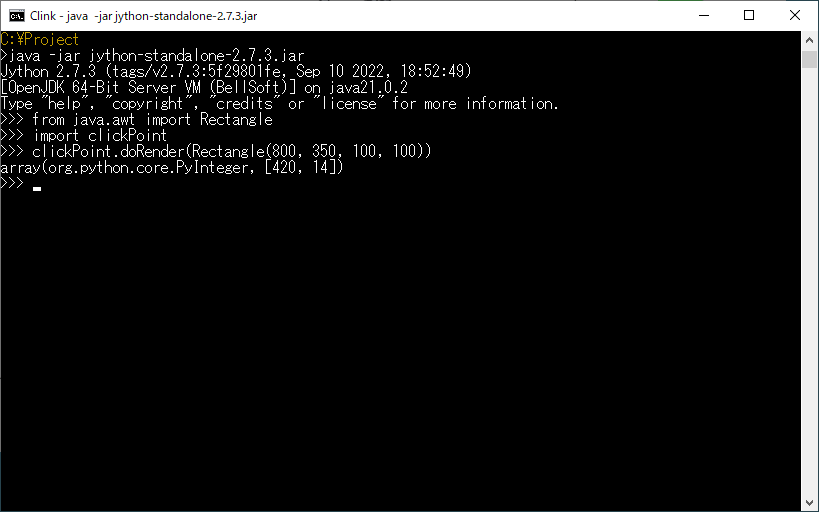
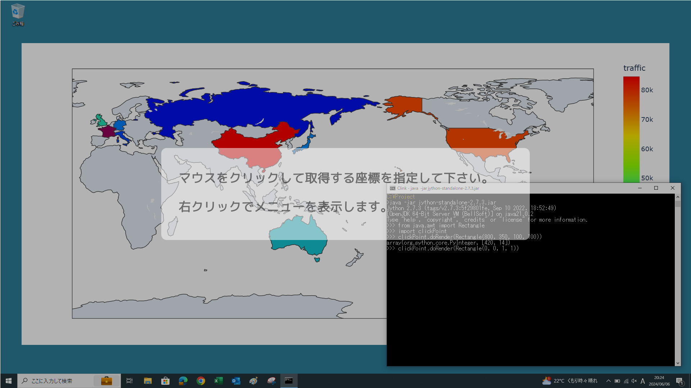

## Jythonで実装したデスクトップ画面座標取得ツール

Jythonにより実装したデスクトップ画面上の任意の矩形の中心からの相対座標を取得するツールです。<br />
単独で実行できるモジュールとなっており、JythonやJavaのプログラムから呼び出して利用することができます。<br />
モジュール内で定義されている**doRender**関数により、ツールを起動します。<br />
VLゴシックフォントを前提としていますが、インストールされていなければ、代替フォントが使用されます。

### doRender関数の仕様
```
<戻り値>
説明：取得した座標データで、キャンセルした場合はNone
データ型：Javaのint型配列で要素0がx座標、要素1がy座標、もしくはNone

<引数>
説明：相対座標の起点となる矩形データ。矩形の中心が座標(0, 0)となる。
データ型：java.awt.Rectangle型

※数値の単位はすべてpx（ピクセル）
```
### ＜実行例の事前準備＞

次項でjshellを使いますが、実行環境のみのjreパッケージには含まれないので、開発環境を含むjdkパッケージ（バージョン9以上）を用意しておきます。jdkは[Oracle][1]、[Adoptium][2]、[BellSoft][3]などのプロジェクトのサイトから入手できます（WindowsとMacで動作確認）。<br />
jdkは任意のディレクトリに配置した上で、javaコマンドを実行できるように環境変数PATHを設定しておきます。<br />
またJythonランタイムのjarファイルは[こちら][4]からダウンロードできます。

[1]: https://www.oracle.com/jp/java/technologies/downloads/
[2]: https://adoptium.net/temurin/archive/
[3]: https://bell-sw.com/pages/downloads/
[4]: https://repo1.maven.org/maven2/org/python/jython-standalone/2.7.3/jython-standalone-2.7.3.jar

### ＜Jythonインタプリタより起動する例＞

下記のコマンドによりJythonインタプリタを対話モードで起動します（サンプル画面はすべてWindows）。
```PowerShell
java -jar jython-standalone-2.7.3.jar
```
Jythonインタプリタが起動したら、プロンプトに続けて下記のようにコードを入力します。
```
>>> from java.awt import Rectangle
>>> import clickPoint
>>> clickPoint.doRender(Rectangle(800, 350, 100, 100))
```

デスクトップ画面の座標取得ツールが起動します。x座標を800、y座標を350、幅100px、高さ100pxに設定しています。
[](../../raw/master/figure1.webp)

デスクトップ上の任意の位置で左クリックすると、起点からの相対座標が表示され、結果を保存するよう促します。
[](../../raw/master/figure2.webp)

任意の位置で右クリックするとメニューが表示され、「セーブ」を選択するとツールが終了します。
[](../../raw/master/figure3.webp)

ツール画面が終了すると、座標の取得結果が戻り値として表示されます。この例では(+420, +14)が結果となっています。
[](../../raw/master/figure4.webp)

絶対座標を取得したい場合は、下記のように引数を指定することにより可能となります。
```python
clickPoint.doRender(Rectangle(0, 0, 1, 1))
```
[](../../raw/master/figure5.webp)

### ＜Javaからツールを呼び出す例＞

今回はjshellにより、対話的にJavaから同様に起動してみます。<br />
jythonランタイムのjarファイルとclickPoint.pyをカレントディレクトリに配置するものとして、まずはjshellを起動します。
```PowerShell
jshell -c jython-standalone-2.7.3.jar
```

jshellが起動したら、プロンプトにつづいて下記のようにコードを実行します。（コメントは省略して構いません）
```
jshell> // 必要なクラスをJythonのランタイムからインポート
jshell> import org.python.util.PythonInterpreter;
jshell> import org.python.core.PyString;
jshell> // Jythonインタプリタのオブジェクトを取得
jshell> PythonInterpreter pyProxy = new PythonInterpreter();
jshell> // Jythonのモジュール検索パスにカレントディレクトリを追加
jshell> pyProxy.getSystemState().path.append(new PyString("."));
jshell> // clickPointモジュールをインポート
jshell> pyProxy.exec("import clickPoint");
jshell> // 必要なJavaのクラスをインポート
jshell> pyProxy.exec("from java.awt import Rectangle");
jshell> // doRender関数を実行してツールを起動
jshell> pyProxy.exec("clickPoint.doRender(Rectangle(800, 350, 100, 100))");
```
するとjythonインタプリタで実行した時と同様に、デスクトップ画面の座標取得ツールが起動されます。
